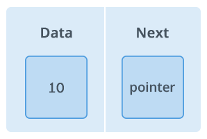
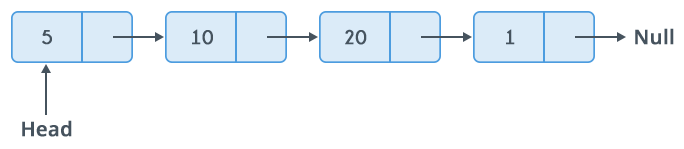

## Linked List

Linked List (atau Senarai Bertautan) merupakan salah satu cara penyimpanan sekumpulan elemen. Mirip dengan array, kumpulan element yang disimpan memiliki hubungan urutan tertentu dimana setiap element dapat memiliki penerus (successor). Namun, hubungan urutan dalam senarai merupakan hubungan secara logis dimana setiap element tidak harus memiliki lokasi memori yang saling berdekatan.

Masing-masing element dalam senarai disimpan dalam sebuah struktur dasar yang disebut **node**. Node berperan sebagai kontainer nilai dan juga memberikan sebuah definisi untuk mengakses elemen penerus.

Secara struktur, sebuah node minimal merupakan gabungan dua komponen; bagian **data** yang menyimpan nilai serta bagian **next** yang menyimpan link menuju ke node penerus.

Linked List terbentuk saat terdapat banyak node yang saling bertaut dan membentuk sebuah rantai. Setiap node menunjuk ke elemen penerus sesuai urutan. Node pertama yang digunakan sebagai referensi saat melakukan traversing disebut sebagai **head**. Umumnya, node terakhir pada senarai akan menunjuk ke **null**.

Terdapat beberapa variasi dalam linked list dengan penambahan karakteristik tertentu untuk mencapai tujuan yang spesifik. Sebagai contoh adalah penambahan komponen pada node berupa link yang menunjuk ke elemen pendahulu (predecessor).