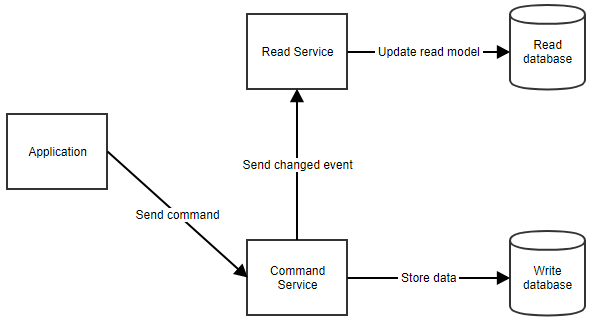
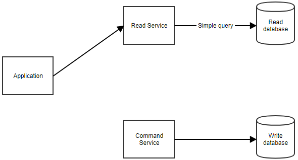

# Programming Reference

Command and Query Responsibility Segregation (CQRS)

## Definisi

Memisahkan operasi `read` dan `write` aplikasi.

Hal ini berarti model yang digunakan untuk operasi write (`command`) akan berbeda dengan model read (`query`). Lebih jauh lagi, data dapat pula disimpan ke lokasi berbeda. Pola ini juga sering dikombinasikan dengan [event sourcing](event-sourcing.md).

## Struktur

Ketika aksi dilakukan aplikasi mengirim perintah ke command-service. Command service mengambil data yang dibutuhkan dari command database, melakukan beberapa manipulasi yang diperlukan dan menyimpan kembali ke database. Service kemudian mengabarkan ke read-service sehingga read-model dapat diperbarui.

Ketika diperlukan untuk menampilkan data ke user, aplikasi akan menghubungi read-service.

## Penggunaan

Arsitektur ini ideal digunakan untuk:

* aplikasi yang membutuhkan banyak operasi read.
* aplikasi dengan domain yang rumit.

## Karakteristik

Keuntungan:

* masing-masing model dapat fokus ke tanggung jawab masing-masing.
    
    - command model dapat fokus ke business logic dan validasi.
    - read model dapat disesuaikan untuk skenario spesifik

* dapat menghindari query yang kompleks (misal: joins di SQL) yang meningkatkan performansi operasi read.

Kekurangan:

* membuat command dan read tersinkronisasi dapat menjadi sangat kompleks.