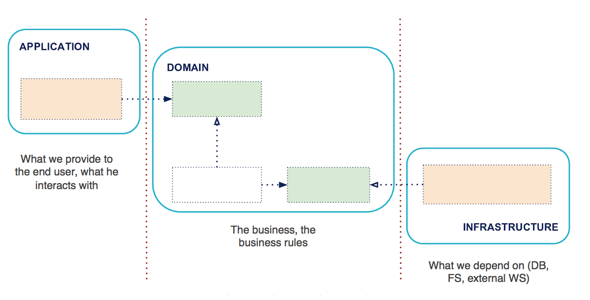

# Programming Reference

Hexagonal (Ports & Adapters)

## Definisi

Membagi aplikasi berdasarkan tanggung jawab menjadi tiga bagian: aplikasi (UI), domain (business-logic), dan infrastruktur dengan domain menjadi inti dari sistem.

## Struktur

Secara prinsip, arsitektur Hexagonal berdasarkan tiga prinsip dan teknik:

* secara eksplisit memisahkan Aplikasi, Domain, dan Infrastruktur
* dependensi mengalir dari Aplikasi dan Intrastruktur menuju DOmain
* isolasi Boundary (batas) dengan Ports dan Adapter.

Sisi Aplikasi adalah sisi dimana interaksi dengan user akan terjadi. Di sisi ini terdapat kode yang menangani interaksi, sebagai contoh: user interface, HTTP routes untuk API, JSON serialization, dsb. Sisi ini adalah sisi dimana kita dapat mencari actor yang memacu Domain.

Sisi Domain adalah bagian yang diisolasi dari sisi kiri (Aplikasi) dan kanan (Infrastruktur). Di sisi ini terdapat kode yang berkaitan dengan implementasi business logic, bagian yang secara konkret menyelesaikan masalah.

Sisi Infrastruktur adalah bagian yang dibutuhkan oleh aplikasi untuk dapat berjalan. Di sisi ini terdapat kode seperti interaksi dengan database, operasi file system, kode yang menangani HTTP calls ke aplikasi lain, dsb.

Komunikasi menuju sisi yang berbeda dilakukan melalui interface yang didefinisikan. Pada arsitektur ini, Domain merupakan bagian dalam (`inside`) sistem dan Aplikasi maupun Infrastruktur disebut sebagai bagian luar (`outside`)

## Penggunaan

Arsitektur ini ideal digunakan untuk:

## Karakteristik

* terdapat tiga bagian aplikasi: aplikasi, domain, infrastruktur.
* interface digunakan sebagai komunikasi.