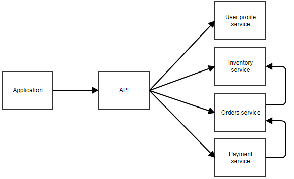

# Programming Reference

Micro Service

## Definisi

Memecah sistem menjadi beberapa service kecil yang mandiri dan hanya menjalankan tugas yang spesifik.

## Struktur

Aplikasi memanggil sebuah gateway (API central) kemudian request akan diteruskan ke microservice yang sesuai. Apabila service memiliki ketergantungan (dependensi) terhadap service lain, maka komunikasi dilakukan antar service dengan request yang dipertukarkan harus dipastikan backward-compatible.

Tidak ada aturan jelas batasan seberapa besar sebuah microservice maupun kompleksitasnya.

## Penggunaan

Arsitektur ini ideal digunakan untuk:

* aplikasi yang memiliki beberapa bagian yang digunakan secara intensif dan memerlukan scaling.
* service yang menyediakan fungsionalitas untuk beberapa aplikasi.
* aplikasi akan menjadi semakin kompleks jika dikombinasikan sebagai aplikasi monolitik
* aplikasi yang mendefinisikan `bounded-context` secara jelas.

## Karakteristik

Tidak terlalu susah untuk membagi aplikasi yang monolitik ke microservice.

Keuntungan:

* dapat menulis, memelihara, dan deploy setiap microservice secara terpisah.
* mudah untuk melakukan scaling dimana hanya perlu melakukan scale up terhadap microservice yang membutuhkan.
* mudah untuk memodifikasi potongan kode dari aplikasi karena setiap service diharapkan berukuran kecil dan tidak tight-couple dengan bagian lain.

Kekurangan:

* membutuhkan banyak perhatian agar microservice dapat bekerja sama dengan baik:

    - communication
    - coordination
    - backward compatibility

* satu aksi dari user dapat dilewatkan ke beberapa microservice yang artinya menjadi multiple points of failure.