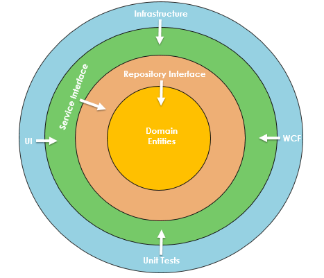

# Programming Reference

Onion

## Definisi

Mendefinisikan lapisan-lapisan konsentris (memiliki inti yang sama) yang saling berinteraksi satu sama lain menuju inti yang merepresentasikan Domain. Tidak ada dependensi ke layer data.

## Struktur

Berdasarkan prinsip Inversion of Control.

Mendefinisikan layer dari Domain (sebagai inti) menuju Infrastruktur. Secara prinsip dasar, arsitektur ini memindahkan semua coupling menuju inti. 

Pada arsitektur Onion, database bukanlah inti dari sistem. Database merupakan bagian eksternal. Decouple antara aplikasi dan database dilakukan dengan menggunakan interface sebagai perantara keduanya.

Beberapa lapisan dari arsitektur Onion:

* Domain
* Repository
* Services
* UI

Lapisan `Domain` di tengah merepresentasikan domain object (business dan behavior). Ide dasarnya adalah mengumpulkan semua domain object di inti ini. Selain domain object, terdapat juga domain interface. Semua entitas domain ini tidak memiliki dependensi.

Lapisan `Repository` menciptakan abstraksi antara entitas domain dan business logic dari aplikasi. Pada lapisan ini terdapat interface yang menyediakan mekanisme penyimpanan dan pengambilan objek dengan melibatkan database. Lapisan ini menciptakan generic repository dan menambahkan query untuk mengambil data dari sumber, memetakan data ke entitas bisnis, dan melakukan pembaruan apabila terjadi perubahan pada entitas bisnis.

Lapisan `Services` memiliki interface dengan operasi umum seperti: Add, Save, Edit, dan Delete. Lapisan ini digunakan untuk berkomunikasi antara UI dan Repository.

Lapisan `UI` menangani urusan berkaitan dengan user interface. Lapisan ini mengimplementasikan prinsip `Dependency Injection` sehingga aplikasi memiliki struktur yang loosely coupled dan dapat berkomunikasi dengan lapisan internal melalui interface.

## Penggunaan

Arsitektur ini ideal digunakan untuk:

* sistem dengan perilaku kompleks.

## Karakteristik

Keuntungan:

* lapisan terhubung melalui interface sehingga koneksi dapat disediakan saat runtime.
* semua dependensi eksternal (database, system call, dsb) direpresentasikan di layer eksternal.
* tidak perlu menciptakan shared project.

Kekurangan:

* seringkali terjadi kesalahan dalam memisahkan tanggung jawab antar lapisan.
* sangat banyak menggunakan interface.