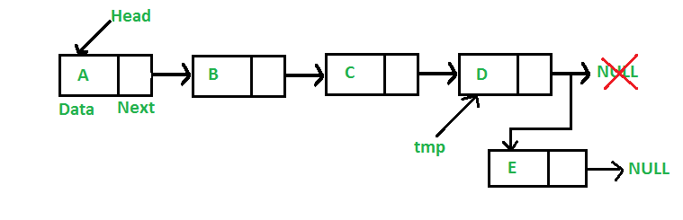
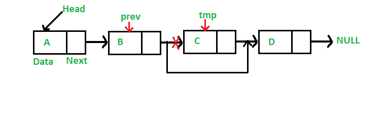

# Programming Reference

Open repository of programming topic for reverse engineering purpose.

## Linked List

Linked List (atau Senarai Bertautan) merupakan salah satu cara penyimpanan sekumpulan elemen. Mirip dengan Array (atau larik), kumpulan element yang disimpan memiliki hubungan urutan tertentu dimana setiap element dapat memiliki penerus (successor). Namun, hubungan urutan dalam senarai merupakan hubungan secara logis dimana setiap element tidak harus memiliki lokasi memori yang saling berdekatan.

Masing-masing element dalam senarai disimpan dalam sebuah struktur dasar yang disebut **node**. Node berperan sebagai kontainer nilai dan juga memberikan sebuah definisi untuk mengakses elemen penerus.

Secara struktur, sebuah node minimal merupakan gabungan dua komponen; bagian **data** yang menyimpan nilai serta bagian **next** yang menyimpan link menuju ke node penerus.

Senarai terbentuk saat terdapat banyak node yang saling bertaut dan membentuk sebuah rantai. Setiap node menunjuk ke elemen penerus sesuai urutan. Node pertama yang digunakan sebagai referensi saat melakukan traversing disebut sebagai **head**. Umumnya, node terakhir pada senarai akan menunjuk ke **null**.

Terdapat beberapa variasi dalam senarai dengan penambahan karakteristik tertentu untuk mencapai tujuan yang spesifik. Sebagai contoh adalah penambahan komponen pada node berupa link yang menunjuk ke elemen pendahulu (predecessor).

### Linked List vs Array

Seperti larik, senarai bertautan merupakan struktur data linier. 

Perbedaan paling mendasar antara senarai dan larik:

- Larik memiliki ukuran tetap (fix), tidak dapat berubah setelah dideklarasikan. Senarai bersifat dinamis dan fleksibel, ukuran dapat berubah tergantung keadaan.
- Setiap elemen di larik diakses dengan index dan dapat diakses secara langsung. Elemen pada senarai tersimpan pada node dan dapat diakses dengan cara menelusuri setiap node dari awal hingga akhir.
- Operasi penyisipan (insertion) dan penghapusan (deletion) di larik membutuhkan wkatu lama karena perlu dilakukan pergeseran (shift) elemen lain. Sementara operasi serupa di senarai dapat berlangsung cepat.
- Senarai, utamanya tiap node, memerlukan overhead memory untuk menyimpan informasi tambahan seperti pointer ke node penerus. larik sangat minimalis dan tidak membutuhkan memory tambahan.
- Node pada senarai dapat dimungkinkan berada pada lokasi memori yang berjauhan sehingga tidak dapat memanfaatkan cache secara maksimal.

### Variasi

Berdasarkan tautan yang dimiliki, node senarai dapat dikategorikan menjadi 2 kelompok yaitu:

- __Singly Linked-List__, satu tautan mengarah ke node penerus. 
- __Doubly Linked-List__, dua tautan mengarah ke node pendahulu dan penerus.

Berdasarkan struktur node, terdapat beberapa kelompok:

- __Plain__, senarai terurai dengan node terakhir menunjuk ke NULL sebagai batas.
- __Sentinel__, terdapat sebuah node dummy dengan tujuan khusus (sebagai penanda, misalnya).
- __Circular__, node akhir akan menunjuk ke node awal sebagai penerus sehingga akan terbentuk struktur sirkular atau berantai.

Berdasarkan karakteristik khusus, terdapat beberapa variasi:

- __Arithmetic__, lokasi node penererus ataupun pendahulu diketahui dengan suatu kalkulasi tertentu. Beberapa operasi yang mungkin adalah: XOR, ADD, SUB.

## Operasi

#### Insertion (Penyisipan)

Sebuah node dapat disisipkan di tiga posisi:

- Di depan, sebagai node pertama atau HEAD.
- Di belakang, sebagai node terakhir atau TAIL.
- Di pertengahan antara HEAD dan TAIL.

#### Searching (Pencarian)

Mencari node dengan elemen tertentu yang memenuhi kriteria.

Berdasarkan banyaknya node yang dihasilkan, pencarian dapat dibagi menjadi dua kategori:

- Hasil tunggal, hanya menginginkan sebuah node saja meskipun kemungkinan ada banyak elemen yang memenuhi.
- Hasil jamak, menginginkan beberapa node yang memenuhi kriteria.

Ketika melakukan pencarian terdapat pula pilihan untuk melakukan cloning terhadap node yang dihasilkan atau sekedar mendapatkan lokasi node tersebut.

#### Deletion (Penghapusan)

Penghapusan node dapat dilakukan terhadap tiga posisi berbeda:

- Di depan, menghapus node pertama atau HEAD.
- Di belakang, menghapus node terakhir atau TAIL.
- Di pertengahan, menghapus node antara HEAD dan TAIL.

Penghapusan dapat dilakukan berdasarkan nilai elemen atau berdasarkan posisi sehingga penghapusan dapat melibatkan pula proses pencarian sebelumnya.

#### Length / Size

Panjang atau ukuran dari senarai menyatakan banyaknya node yang ada pada senarai. Panjang senarai dapat diketahui dengan dua pendekatan yaitu:

- Menyimpan informasi panjang dan melakukan update setiap terdapat operasi penyisipan dan penghapusan. 
- Menghitung panjang secara manual (iteratif maupun rekursif).